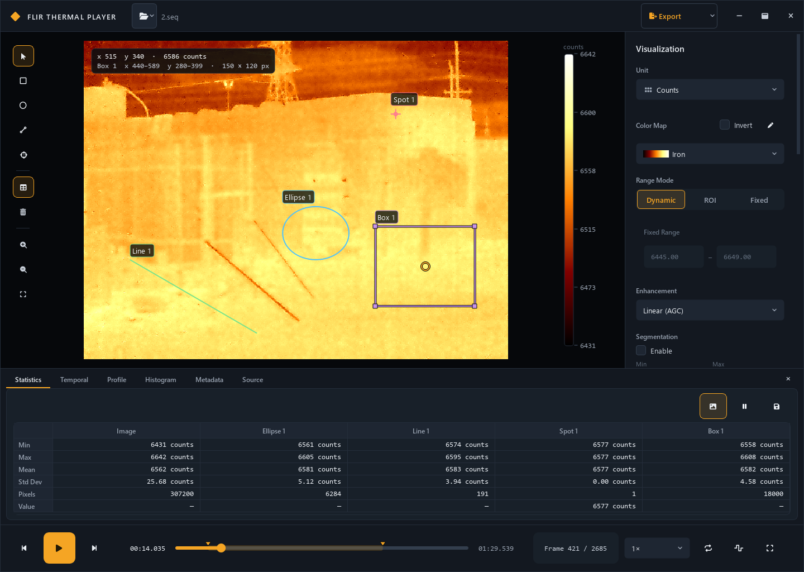

# FLIR Thermal Player

[](https://github.com/infinitr0us/FLIR_Player/actions/workflows/ci.yml)
[](LICENSE)

A modern Windows desktop player for FLIR radiometric recordings. It opens
`.seq`, `.ats`, `.sfmov`, and `.csq` files through FLIR File SDK while keeping
all decoding work off the GUI thread.



## What the new player supports

- Recorded-timestamp playback rather than a hard-coded frame interval, with an
  optional constant-rate mode (`R`) for recordings that dropped frames at
  capture time and would otherwise play back as unevenly as they were recorded.
- Capture-cadence reporting: the Source tab states the average frame rate and,
  where the camera's preset rate is known, how many frames of the capture grid
  the file actually stored.
- Play, pause, single-frame stepping, timeline scrubbing, and 0.25×–4× speed.
- Counts, object signal, factory/user temperature (°C, °F, K, °R), and radiance
  modes, driven by the units the file actually supports.
- Editable measurement (object) parameters — emissivity, reflected and
  atmosphere temperature, atmospheric transmission, distance, relative
  humidity, and external optics — with one-click reset to the file defaults.
- Analysis ROIs: box, ellipse, line, and pinned spot meters drawn directly on
  the image, with selection, move, resize, and per-ROI color coding.
- A tabbed analysis panel with: per-ROI statistics (min/max/mean/std-dev/
  pixel-count plus a whole-image column, pause, CSV export), temporal plot of
  ROI statistics versus time (history bounded per ROI, downsampled for
  display without losing short excursions), line-profile plot, histogram
  plot, per-frame header metadata (with entry picker), and static source
  information (camera, lens, calibration ranges).
- Scale-from-ROI range mode alongside dynamic and fixed scaling.
- Overlay toggles: clipping indicators for out-of-calibration pixels and
  min/max location markers for the image and each ROI.
- NUC / bad-pixel apply toggles when the recording carries embedded corrections.
- Extract: trim a recording to a frame range (with optional decimation) into a
  new ATS file, with progress and cancel. Note: the File SDK only extracts
  from ATS sources.
- Zoom (fixed levels ¼×–4× plus mouse-wheel zoom), pan (middle-drag or drag on
  empty space), and an overlay minimap with viewport rectangle.
- Play-range start/end markers on the timeline (`I` / `O` to set, `X` to
  clear, draggable on the slider) that constrain playback and seed the
  Extract dialog; optional loop playback (`L`).
- Eleven built-in color maps with invert, plus a custom gradient palette
  editor (draggable color stops, persisted across sessions).
- Plateau-equalization AGC with an aggressiveness control, alongside linear.
- Isotherms (Above / Below / Interval) with limits editable in the inspector
  or by dragging directly on the color bar.
- Segmentation: user-defined valid range with blue/red out-of-range display
  and auto-scale restricted to valid pixels.
- Software image flip, horizontal and vertical.
- File operation: add / subtract / multiply / divide by a reference frame
  (any frame of the open file or of another same-size recording).
- Point (gain, offset, exp, ln, sqrt), spatial (gaussian, window average,
  median), and temporal (min, max, frame average, sliding subtraction)
  filters, applied in a pipeline inside the decoder thread. The median kernel
  size is capped per resolution to bound memory, and the inspector always
  shows the kernel actually applied.
- Open Recent on the Open button (last 8 recordings, persisted) and wider
  format support: SEQ, ATS, SFMOV, CSQ plus FFF, PTW, and radiometric TIFF.
- Still-image export with composition options (color bar, ROIs and names,
  min/max markers, timestamp burn-in, border) to PNG, BMP, JPEG, TIFF 16-bit,
  or TIFF 32-bit float, with an optional statistics sidecar CSV.
- Movie export to MP4 (H.264) or WMV with frame range, skip pattern, frame
  rate, and the same composition options.
- Numbered image-series export with a frame-skip pattern and an optional
  per-frame statistics CSV.
- ROI bitmask export (one PNG mask per ROI, via the File SDK).
- Batch extract of multiple ATS recordings into a folder, with an honest
  per-file report (the SDK extracts from ATS sources only).
- Dynamic per-frame scaling or a user-defined fixed range.
- Live cursor coordinates and radiometric value inspection.
- PNG display export plus raw NumPy and CSV export.
- Drag-and-drop opening, full-screen inspection, tooltips, and keyboard shortcuts.
- A byte-budgeted frame cache (64 MiB by default); the application never loads
  the full recording into RAM, and long temporal-plot sessions are bounded per
  ROI with excursion-preserving downsampling.

The application entry point is `flir_player_app.py`, which launches the
`flir_player/` package.

## Prerequisites: the FLIR File SDK

This player is a front end for the **FLIR File SDK** (the `fnv` / `FileSDK`
Python package). The SDK is **not distributed with this project**: it is
proprietary to FLIR/Teledyne and is marked export-controlled (EAR99). You must
obtain it from FLIR yourself and install it into your Python environment before
running the player.

- Download the `FileSDK` wheel matching your platform and Python version
  (this project targets **64-bit Python 3.11 on Windows**).
- Install it into your environment, for example:

  ```powershell
  pip install FileSDK-5.0.1-cp311-cp311-win_amd64.whl
  ```

Everything else the player needs is in `requirements.txt`.

## Run it

With the FLIR File SDK already installed (see above), install the remaining
dependencies and launch the app. For example, in a Python 3.11 environment
(a Conda env named `FLIR` is used here — adjust the interpreter path to yours):

```powershell
python -m pip install -r requirements.txt
python flir_player_app.py
```

You can also double-click `run_modern.bat`, or open a recording directly:

```powershell
python flir_player_app.py fire2.seq
```

## Standalone Windows release

You can build a single-file 64-bit Windows GUI executable that does not require
Python, Conda, or PySide6 on the target computer. **The prebuilt `.exe` is not
included in this repository**, because a one-file bundle embeds the FLIR File
SDK's native components, which are proprietary and export-controlled and are not
ours to redistribute. Build it locally instead, and only share the resulting
binary with users your FLIR SDK license permits.

To build the executable from this checkout, double-click `build_exe.bat` or
run it from a terminal. The script installs/verifies the Python dependencies,
runs PyInstaller (the specification explicitly includes the FLIR native DLLs
and the imageio-ffmpeg encoder binary, and excludes Anaconda's incompatible
legacy ICU shadow DLL), then regenerates `release/BUILD_INFO.txt`,
`release/SHA256SUMS.txt`, and `release/README.txt` via
`packaging/finalize_release.py`, and smoke-tests the built executable against
the sample recording `local/data/2.seq`. Only a successful smoke test marks the
release metadata as verified. A build that fails the smoke test exits with code 2.

The executable contains FLIR File SDK components. Check the FLIR SDK license
and the EAR notice in the installed `fnv` package before redistributing it
outside your permitted users or organization.

## Controls

| Action | Control |
| --- | --- |
| Open recording | `Ctrl+O` or drag a file onto the window |
| Reopen a recent recording | arrow next to the Open button |
| Play / pause | `Space` |
| Previous / next frame | `Left` / `Right` |
| Jump 10 frames | `Shift+Left` / `Shift+Right` |
| First / last frame | `Home` / `End` |
| Export rendered frame | `Ctrl+E` |
| Draw ROI | left toolbar: box, ellipse, line, or spot; drag on the image (click for spot) |
| Edit ROI | select tool: drag body to move, drag handles to resize |
| Delete selected ROI | `Del` or the toolbar trash button |
| Show / hide analysis panel | toolbar table button (Statistics, Temporal, Profile, Histogram, Metadata, Source tabs) |
| Zoom in / out | `+` / `-`, mouse wheel, or the toolbar magnifier buttons |
| Fit to window / 100 % | `0` / `1` |
| Pan | middle-drag, or drag empty space with the select tool while zoomed |
| Set play-range start / end | `I` / `O` (drag the markers on the timeline to adjust) |
| Clear play range | `X` |
| Loop playback | `L` or the transport repeat button |
| Constant-rate playback | `R` or the transport square-wave button |
| Full-screen inspection | `F` or double-click the thermal image |
| Leave full screen | `Esc` |

## Architecture

`DecoderThread` is the sole owner of the FLIR File SDK object. It returns
detached NumPy frames to the main thread and keeps a byte-budgeted LRU cache
(64 MiB by default) of recent packets. Interactive frame requests are
latest-wins — stale queued seek/scrub work is coalesced away before the SDK
touches it — while state changes (unit, parameters, corrections, filters,
exports) keep strict FIFO order.

Playback uses an absolute media clock anchored to each recording's frame
timestamps, so a recording that dropped frames during capture plays back as
unevenly as it was recorded — that wobble is in the file, not the player.
Constant-rate mode (`R`) re-anchors the same clock to frame index × the
recording's average rate instead, which paces frames evenly and preserves the
total duration; the elapsed-time readout keeps showing recorded time, so it
steps across the gaps. Decoding runs ahead of presentation through a small bounded
queue, so decode, processing, and rendering overlap the presentation wait
instead of serializing. If the player falls behind, it drops or skips forward
to stay on the media clock, which keeps the 0.25×–4× speed multipliers
wall-clock accurate; while a temporal filter is active every frame is still
decoded (only presentation drops), so filter state stays correct. Whole-image
statistics reuse the SDK's built-in image ROI when no processing is active,
and colorization runs in float32 with reusable scratch buffers and fused
overlay passes.

Set `FLIR_PERF_DEBUG=1` to print per-second playback counters (presented
fps, drops, skips, media-clock lateness) to stderr.

## Verification

Run the automated suite with:

```powershell
python -m pytest -q
```

Note: a large part of the suite opens real FLIR recordings (referenced as
`local/data/1.ats` and `local/data/2.seq`, in a git-ignored folder) and
requires both the FLIR File SDK and those sample files to run. Because neither
the SDK nor the recordings are distributed here, those tests are skipped on a
bare clone. Provide your own recordings at those two paths to exercise the
full suite.

The tests cover rendering/range utilities, both supplied FLIR recordings, Qt
opening and playback, seeking, unit switching, object-parameter round-trips,
ROI statistics against NumPy references, canvas ROI interaction, the
statistics table, and extraction (success, unsupported-source, and abort
paths), plus the Tier-3 additions: plateau equalization, isotherm and
segmentation overlays, palette LUTs and custom-palette persistence, flip
coordinate mapping, zoom/pan/minimap geometry, the play-range slider and loop
playback, and the processing pipeline (file operation, point/spatial/temporal
filters, app-side ROI statistics, temporal-buffer windowing), plus the Tier-4
export paths: export composition, TIFF 16-bit/float round-trips, MP4/WMV
writing, decoder-driven series/movie export, batch extract reporting, ROI
bitmasks, and recent-file tracking, plus the main interaction states.

The performance work is guarded by its own parity suite
(`tests/test_perf_parity.py`): SDK-vs-NumPy whole-image statistics across
units and edge cases, float32 colorization tolerance parity against the
float64 reference, request coalescing, prefetch and end-of-range
presentation (including loop wraps), cache byte accounting and payload
completeness, bounded temporal history and envelope downsampling, and
filter-kernel parity.

## Analysis and export behavior

Temporal filters use the trailing source-frame window
`max(0, frame - depth + 1) ... frame`. Seeking, reverse stepping, cache hits,
metadata refreshes and export use that same definition. Decimation selects
which results to write; intervening frames still contribute to filtering.
Reference arithmetic promotes integer Counts before calculating differences
or products. References use the current unit, object parameters and available
correction switches; an incompatible reference rejects the state change.

Changing numerical analysis settings clears temporal plot history. Editing an
ROI clears that ROI's history. Palette and zoom changes preserve it. Temperature
overlay limits convert between compatible temperature units; subtraction uses
temperature-difference conversion. Other numerical-domain or source changes
reset the limits to the new frame's range.

ROI statistics, histogram/profile sampling and masks share pixel coverage:
boxes exclude the right/bottom endpoint, ellipses include pixel centers inside
that box, and lines sample each major-axis pixel once. Profile distance is in
image pixels. Plateau-equalized legends use the frame's actual color mapping.

Exports and extracts stage their output and publish only after successful
completion. Existing paths are refused; choose a new filename. Source aliases
are always rejected. Batch extraction allocates distinct names and saves a JSON
report with the actual path and outcome for each input. Failed or cancelled jobs
remove their own staging files. Closing waits responsively for SDK operations
and writers to finish.

Numeric TIFF16 preserves unprocessed `uint16` Counts exactly. Other data is
mapped over the selected range; TIFF `ImageDescription` records the scale,
offset, clipping policy, unit, processing and measurement provenance. Use float
TIFF or NumPy export for processed values outside the display range or nonfinite
values. Numeric TIFFs have no RGB overlays, flips or composition. Movie export
preserves the image dimensions and pads an odd edge by one pixel for encoding.
Still exports retain the frame chosen before the dialog; statistics CSV saves
the displayed statistics snapshot, including when the table is paused.

Tests use temporary INI preferences and do not write the application's registry
settings. Set `FLIR_SETTINGS_FILE` to an INI path to isolate another run.

## License

Copyright (C) 2026 Yuchuan Li &lt;Yuchuan.Li@outlook.com&gt;

The FLIR Thermal Player application code in this repository (the `flir_player`
package, `flir_player_app.py`, the tests, and the packaging scripts) is licensed
under the **GNU General Public License v3.0 or later**. See the [LICENSE](LICENSE)
file for the full text.

This license covers **only** the code written for this project. It does **not**
cover, and this project does **not** grant any rights to:

- **The FLIR File SDK** (`FileSDK` / the `fnv` package and its native
  binaries). This is proprietary to FLIR/Teledyne, is marked export-controlled
  (EAR99), and is **not** included in this repository. Obtain it from FLIR under
  their own license terms.
- **FLIR ResearchIR** and its documentation, referenced here only as a feature
  benchmark. "FLIR" and "ResearchIR" are trademarks of their respective owners;
  this is an independent project and is not affiliated with or endorsed by FLIR
  or Teledyne.

Because the packaged Windows executable embeds proprietary, export-controlled
FLIR components, do not redistribute a built `.exe` outside the users your FLIR
SDK license permits.
